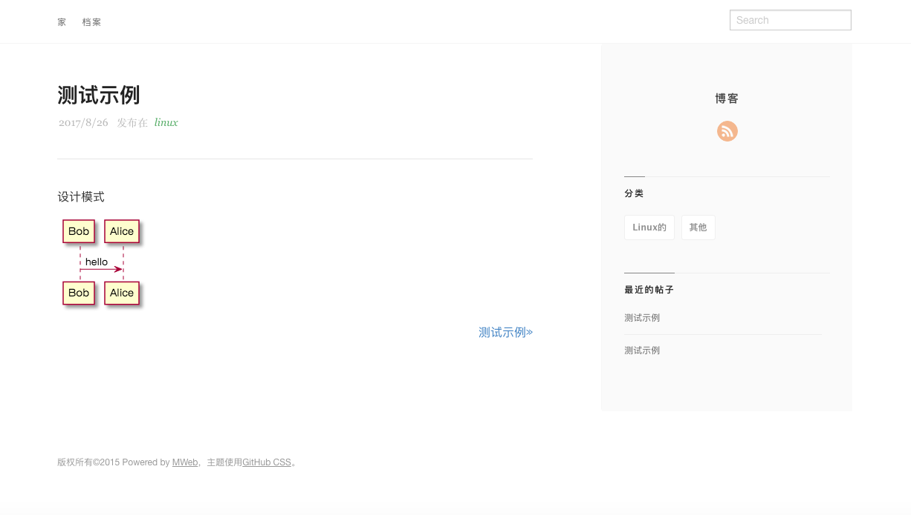
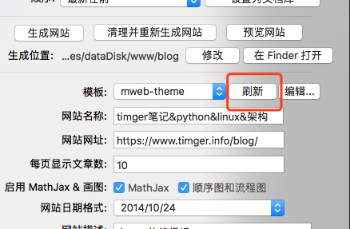

mweb 的定制主题

1. 支持 plantuml
2. 支持 echart
3. 支持生成静态网站


## 预览




## 示例地址

[timger.info](http://www.timger.info/blog/index.html)

## 用法

#### clone

```$xslt
cd ~/Library/Containers/com.coderforart.MWeb/Data/Documents/themes/
git clone git@github.com:yishenggudou/mweb-theme.git
```

#### 刷新



